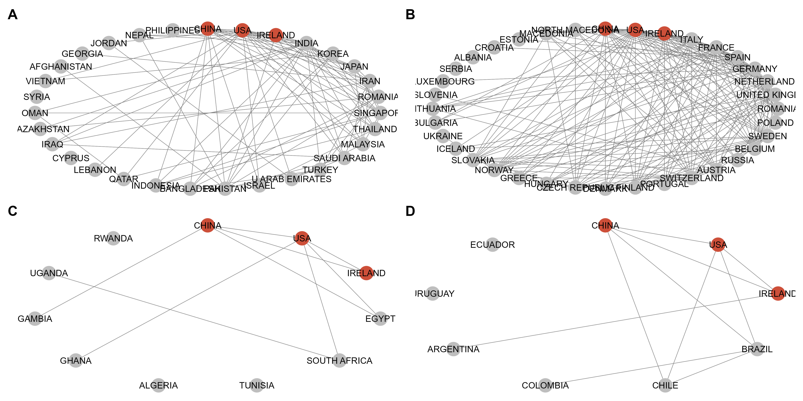

# **A Bibliometric Analysis of the Microbiome-Gut-Brain axis Field : A Living Article**

#### Authors: [Benjamin Valderrama](https://benjamin-valderrama.github.io/about.html).

#### Last update: June 2025.

------------------------------------------------------------------------

## Index

1.  [Abstract](##Abstract)
2.  [Introduction](##Introduction)
3.  [Methods](##Methods)
4.  [Results and Discussion](##Results-and-Discussion)
5.  [Conclusion](##Conclusion)
6.  Supplementary material
7.  [References](##References)

------------------------------------------------------------------------

## Abstract

An semi-automated bibliometric analysis of the publications made on the Microbiome-Gut-Brain axis field. Although presented as a paper, it is just a small report made to explore some hypotheses I have about the field I'm working on.

## Introduction

I'm using this published work by [(Wang et al. 2020)](https://pmc.ncbi.nlm.nih.gov/articles/PMC9119018/) as a reference.

## Results and Discussion

{alt="Collaboration networks between the 3 most productive countries and other world regions. (A) Asia (B) Europe (C) Africa (D) South America. The top 3 most productive countries (China, Ireland and USA) are shown in red. Other countries in grey."}

## Strenghts and Limitations

## Conclusion

## Methods

**Data collection**

The data was collected using the [Web of science (WoS) search tool](https://www-webofscience-com.ucc.idm.oclc.org/wos/woscc/basic-search). The Search was conducted on the 10th of June, 2025. The following query was used:

> ((ALL=("microbiota gut brain" OR "microbiotas gut brain" OR "microbiome gut brain" OR "microbiomes gut brain" OR "microbial community gut brain" OR "microbial communities gut brain"))) AND DOP=(1945/2025)

**Data analysis and ploting**

The data was analysed using the [bibliometrix](https://www.bibliometrix.org/home/) package. Networks were ploted using the [ggnet2](https://briatte.github.io/ggnet/#:~:text=The%20ggnet2%20function%20is%20a,one%2Dmode%20igraph%20network%20objects.) package

## References

[Wang H, Long T, You J, Li P, Xu Q. Bibliometric Visualization Analysis of Microbiome-Gut-Brain Axis from 2004 to 2020. Med Sci Monit. 2022 May 15;28:e936037. doi: 10.12659/MSM.936037. PMID: 35568968; PMCID: PMC9119018.](https://pmc.ncbi.nlm.nih.gov/articles/PMC9119018/)
