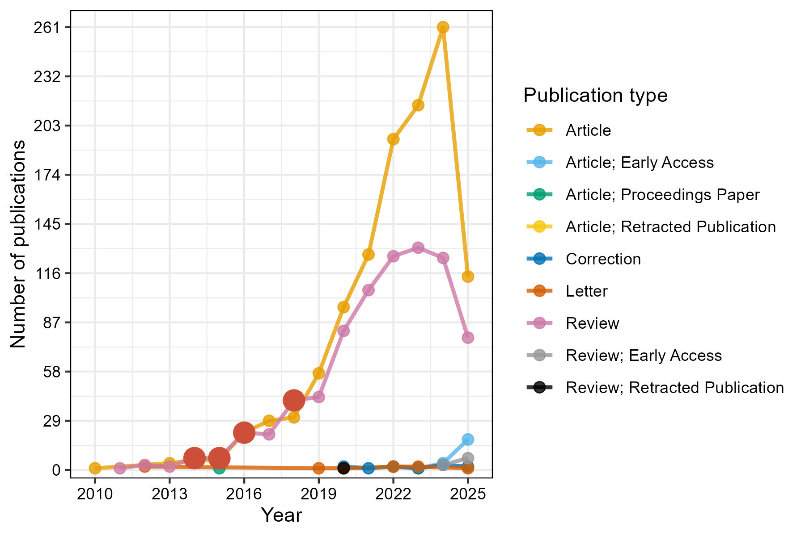
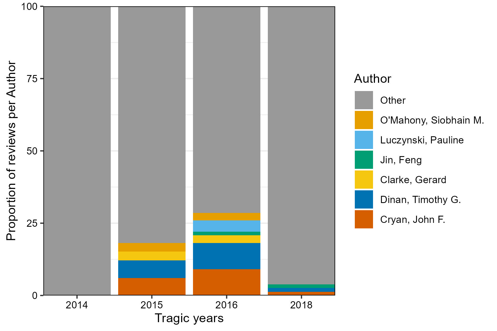

# **A Living Bibliometric Analysis of the Microbiome-Gut-Brain axis field**

#### Authors: [Benjamin Valderrama](https://benjamin-valderrama.github.io/about.html).

#### Last update: June 2025.

------------------------------------------------------------------------

## Abstract

An semi-automated bibliometric analysis of the publications made on the Microbiome-Gut-Brain axis field. Although presented as a paper, it is just a small report made to explore the field I'm working on.

## Introduction

I'm using [this published work](https://pmc.ncbi.nlm.nih.gov/articles/PMC9119018/) as a reference.

## Results and Discussion

[Number of publications over time]{.underline}

First, we wanted to explore the number of publications published by year (Figure 1). As in many fields, the tendency is to increase the number of original articles and reviews over the years. Note the big red dots representing years where the number of published reviws is at least as high as the number of published research articles. This are called *'tragic years'*, as the number of research articles is lower than the number of reflective or compilation pieces. Note the lack of tragic years after 2018.

{width="450"}

Then, we wanted to check what authors wrote the most number of reviews on the *tragic years.*

{width="500"}

## Strenghts and Limitations

## Conclusion

## Methods

The data was collected using the [Web of science (WoS) search tool](https://www-webofscience-com.ucc.idm.oclc.org/wos/woscc/basic-search). The Search was conducted on the 09th-June-2025, using the following term:

> ((ALL=("microbiota gut brain" OR "microbiotas gut brain" OR "microbiome gut brain" OR "microbiomes gut brain" OR "microbial community gut brain" OR "microbial communities gut brain"))) AND DOP=(1945/2025)

The data was analysed using the [Bibliometrix](https://www.bibliometrix.org/home/) package.
